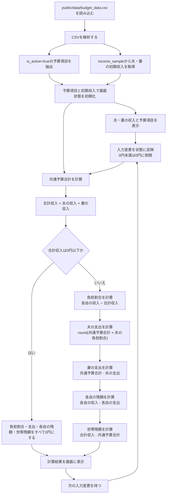

# 家計負担割合計算の処理フロー

この図は、計算ページで共通予算と夫婦それぞれの収入を読み込み、負担割合・支出・残額を表示するまでの処理を示します。

## 表示と計算の補足

- 夫の負担割合は夫の収入を合計収入で割り、妻の負担割合も同様に計算します。
- 支出の端数処理は夫の支出を円単位で四捨五入し、妻の支出を予算合計との差額にすることで、2人の支出合計を共通予算と一致させます。
- 負担割合は小数第1位まで、金額は円単位で表示します。残額がマイナスになる場合もそのまま表示します。
- 収入や予算を変更すると、計算結果は画面上で即時に更新されます。

## 実装参照先

- `src/app/layout.tsx`：CSVデータの読み込みと初期値の受け渡し
- `lib/csv.ts`：CSVの解析、予算項目の抽出、初期収入の取得
- `src/app/components/HouseholdDataProvider.tsx`：入力値と予算項目の状態管理
- `src/app/components/Calculator.tsx`：負担割合・支出・残額の計算と表示
